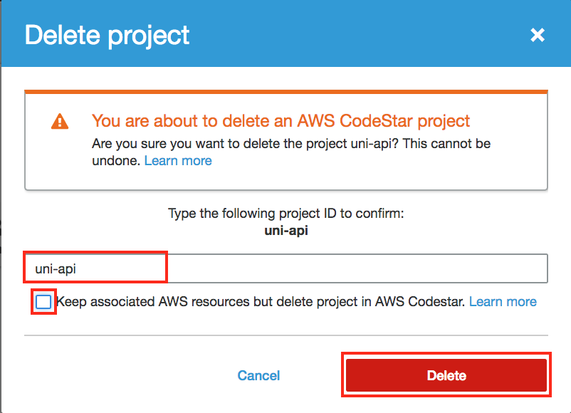

# Workshop Cleanup

This page provides instructions for cleaning up the resources created during the preceding modules.

## Resource Cleanup Instructions

### 1. Detach IAM Managed Policies from CodeStarWorker Roles

#### 1a. Detach IAM Policies from `CodeStarWorker-uni-api-CloudFormation` Role

1. In the AWS Management Console, click **Services** then select **IAM** under Security, Identity & Compliance.

1. Select **Roles** from the navigation menu.

1. Type `CodeStarWorker-uni-api-CloudFormation` into the filter box and click **CodeStarWorker-uni-api-CloudFormation** in the list of role.

1. For each of the following attached IAM Managed Policies, Click **Detach Policy** next to the policy and click **Detach** in the confirmation dialog box:

    * **AWSLambdaReadOnlyAccess**

#### 1b. Detach IAM Policies from `CodeStarWorker-uni-api-CodePipeline` Role

1. In the AWS Management Console, click **Services** then select **IAM** under Security, Identity & Compliance.

1. Select **Roles** from the navigation menu.

1. Type `CodeStarWorker-uni-api-CodePipeline` into the filter box and click **CodeStarWorker-uni-api-CodePipeline** in the list of role.

1. For each of the following attached IAM Managed Policies, Click **Detach Policy** next to the policy and click **Detach** in the confirmation dialog box:

    * **AWSCodePipelineReadOnlyAccess**
    * **AWSLambdaRole**

#### 1c. Detach IAM Policies from `CodeStarWorker-uni-api-Lambda` Role

1. In the AWS Management Console, click **Services** then select **IAM** under Security, Identity & Compliance.

1. Select **Roles** from the navigation menu.

1. Type `CodeStarWorker-uni-api-Lambda` into the filter box and click **CodeStarWorker-uni-api-Lambda** in the list of role.

1. For each of the following attached IAM Managed Policies, Click **Detach Policy** next to the policy and click **Detach** in the confirmation dialog box:

    * **AmazonDynamoDBFullAccess**
    * **AWSCodePipelineCustomActionAccess**
    * **AWSCloudFormationReadOnlyAccess**
    * **AWSLambdaRole**
    * **AWSXrayWriteOnlyAccess**

### 2. Delete CodeStar Project

1. In the AWS Management Console choose **Services** then select **CodeStar** under Developer Tools.

1. Click the **...** icon in the `uni-api` project and select **Delete**.

    

1. Type `uni-api` as the project ID to confirm,  **Unselect** the checkbox to delete the CloudFormation resources, and click the **Delete* *button.

    

### 2. Delete CloudFormation CodeCommit Seed Stacks

1. In the AWS Management Console, click **Services** then select **CloudFormation** under Management Tools.

1. Repeat the following steps for each of the following CloudFormation Stacks:

    * **Seed-1-ServerlessApplicationModel**
    * **Seed-2-ContinuousDelivery**
    * **Seed-3-XRay**
    *  **Seed-4-MultipleEnvironments**

    a. Click the checkbox to the left of the stack
    
    b. Select the Actions dropdown menu above the list of Stacks.
    
    c. Select **Delete Stack**.
    
    d. Select **Yes, Delete**.

### 3. Delete CodeStar Project S3 Bucket

1. In the AWS Management Console, click **Services** then select **S3** under Storage.

1. Type `uni-api` in the Filter checkbox.

1. Click the bucket icon next to the S3 bucket that matches the format: `aws-codestar-{AWS::Region}-{AWS::AccountId}-uni-api-pipe`.

1. Click the **Delete Bucket** button at the top of the Bucket list.

1. Type the name of the bucket to confirm the deletion and click **Confirm**.
