# Module: Coordinate a serverless image processing workflow with AWS Step Functions

In this module you'll use AWS Step Functions to build an image processing workflow by orchestrating multiple AWS Lambda functions. 

The Wild Rydes team wants to add a new feature to the app by requiring riders to upload a selfie after signing up. This accomplishes a few things: 

1. Allows the unicorns to easily identify the rider during pickup to provide a good customer experience. This also enhances security so bad guys can't spoof to be riders and get on the unicorns. 
1. Prevents the same user from signing up for multiple accounts to abuse new-user promotions.  


When users upload the photo of themselves, a few steps of verification and processing need to take place:

1. Verify the photo shows a clear face the app/unicorns can use to identify the rider. 
1. Match against the collection of previously indexed faces to make sure the user hasn't already signed up.
1. Resize the photo to thumbnails to display on the app.
1. Index the user's face into the collection so it can be used for matching in the future. 
1. Store the photo metadata with the user's profile.  

In the serverless world, each of steps above can be easily implemented with a AWS Lambda function. But how can we manage the flow of invoking one Lambda function after the previous step has finished and keep track of what happened with each image? What if one of the Lambda function times out and needs to be retried? Some of the Lambda functions can be run in parallel to reduce end-to-end processing latency, how can we coordinate running Lambda functions in parallel and wait for them to finish? AWS Step Functions makes it very easy to solve these problems and provides an audit trail and visualization to track what happened with each flow. 
## Architecture Overview
The architecture for this module is composed of several AWS Lambda functions that leverage the facial detection capabilities of **Amazon Rekognition**, resize the uploaded image stored in **Amazon S3**, and save the image metadata with the user profile using **Amazon DynamoDB**. The orchestration of these Lambda functions is managed by an **AWS Step Functions**  state machine.


Below is the flow diagram of the workflow we will build as visualized by  **AWS Step Functions**:


In this module, we will manually kick-off processing workflows from the AWS Step Functions management console. In a real world application, you can configure an Amazon API Gateway that your application invokes to trigger the Step Functions state machine, or have it triggered by an Amazon S3 upload event through Amazon CloudWatch Events or S3 event notifications. 
## Implementation Instructions

Each of the following sections provide an implementation overview and detailed, step-by-step instructions. The overview should provide enough context for you to complete the implementation if you're already familiar with the AWS Management Console or you want to explore the services yourself without following a walkthrough.

If you're using the latest version of the Chrome, Firefox, or Safari web browsers the step-by-step instructions won't be visible until you expand the section.

 

</p></details>
 
### 1. Create a collection in Amazon Rekognition
A Face Collection is a container in Amazon Rekognition to store indexed face images as searchable vectors.  

Using the AWS Command Line Interface, create a collection in the Amazon Rekognition called `rider-photos`

<details>
<summary><strong>Step-by-step instructions (expand for details)</strong></summary><p>

1. In a terminal window, run the following command and replace the `REPLACE_WITH_YOUR_CHOSEN_AWS_REGION` portion with the region string of your chosen region. (see [Rekognition regions](http://docs.aws.amazon.com/general/latest/gr/rande.html#rekognition_region))

		aws rekognition create-collection --region REPLACE_WITH_YOUR_CHOSEN_AWS_REGION --collection-id rider-photos
	
	For example:
	
		aws rekognition create-collection --region us-east-1 --collection-id rider-photos
		aws rekognition create-collection --region us-west-2 --collection-id rider-photos
		aws rekognition create-collection --region eu-west-1 --collection-id rider-photos
	
	
2. If successful, you should get an acknowledgment from the service that looks like:

	```JSON
	{
    	"CollectionArn": "aws:rekognition:us-west-2:012345678912:collection/rider-photos",
    	"StatusCode": 200
	}
	```
</p></details>

### 2. Deploy Amazon S3, AWS Lambda and Amazon DynamoDB resources using AWS CloudFormation

The following AWS CloudFormation template will create these resources:
* Two Amazon S3 buckets: 
	* **RiderPhotoS3Bucket** stores the photos uploaded by the riders
	* A few test images will be copied into the **RiderPhotoS3Bucket**  bucket
	* **ThumbnailS3Bucket** stores the resized thumbnails of the rider photos
* One Amazon DynamoDB table **RiderPhotoDDBTable** that stores the metadata of the rider's photo with rider's profile
* AWS Lambda functions that performs the processing steps


Click on the link for the region you have chosen:  

Region| Launch
------|-----
US East (N. Virginia) | [](https://console.aws.amazon.com/cloudformation/home?region=us-east-1#/stacks/new?stackName=wildrydes-step-module-resources&templateURL=https://s3.amazonaws.com/wild-rydes-step-module-us-east-1/0-cfn/wild-rydes-step-module-us-east-1.output.yaml)
US West (Oregon) | [](https://console.aws.amazon.com/cloudformation/home?region=us-west-2#/stacks/new?stackName=wildrydes-step-module-resources&templateURL=https://s3-us-west-2.amazonaws.com/wild-rydes-step-module-us-west-2/0-cfn/wild-rydes-step-module-us-west-2.output.yaml)
EU (Ireland) | [](https://console.aws.amazon.com/cloudformation/home?region=eu-west-1#/stacks/new?stackName=wildrydes-step-module-resources&templateURL=https://s3-eu-west-1.amazonaws.com/wild-rydes-step-module-eu-west-1/0-cfn/wild-rydes-step-module-eu-west-1.output.yaml)

<details>
<summary><strong>AWS CloudFormation Launch Instructions (expand for details)</strong></summary><p>

1. Click the **Launch Stack** link above for the region of your choice.

1. Click **Next** on the Select Template page.

1. On the Specify Details page, leave all the defaults and click **Next**.

1. On the Options page, leave all the defaults and click **Next**.

1. On the Review page, Click the checkboxes to give AWS CloudFormation permission to **"create IAM resources"** and **"create IAM resources with custom names"**

1. Click **"Create Change Set"** in the Transforms section

1. Click **"Execute"**

1. Wait for the `wildrydes-step-module-resources` stack to reach a status of `CREATE_COMPLETE`.

1. With the `wildrydes-step-module-resources` stack selected, click on the **Outputs** tab. These resources will be referenced in the later steps. 

</p></details>


### 3. Create an initial AWS Step Functions state machine

After the riders upload their photo, the first thing we need do in our processing pipeline is to run a face detection algorithm on it to verify that it has a recognizable face in the photo (zero or multiple faces in the photo doesn't help unicorns recognize the rider) and the face is not wearing sunglasses (makes it harder to identify the rider). If these validations fail, notify the user and end the workflow.

The AWS Lambda function that implements this check by leveraging the **Amazon Rekognition** deep-learning based image analysis API is already deployed by AWS CloudFormation in the previous step. Look in the **Outputs** section for `FaceDetectionFunctionArn` for the ARN of the Lambda function. 

The AWS Lambda function to be called when the validations fail is the  `NotificationPlaceholderFunction` deployed by AWS CloudFormation. The intent behind this step is to notify the user the photo validation failed and the error reason, so they can try upload a different photo. It's currently a stub implementation that just prepares the message instead of actually sending the message. 

Now you can create an AWS Step Functions state machine with the initial face detection step.


<details>
<summary><strong>Step-by-step instructions (expand for details)</strong></summary><p>

1. AWS Step Functions state machine flows are defined by a JSON document. In your favorite text editor, create a file called `rider-photo-state-machine.json`.

1. Copy and paste the following into your JSON file:

	```JSON
	{
	  "Comment": "Rider photo processing workflow",
	  "StartAt": "FaceDetection",
	  "States": {
	    "FaceDetection": {
	      "Type": "Task",
	      "Resource": "REPLACE_WITH_FaceDetectionFunctionArn",
	      "ResultPath": "$.detectedFaceDetails",
	      "End": true,
	      "Catch": [
	        {
	          "ErrorEquals": [
	            "PhotoDoesNotMeetRequirementError"
	          ],
	          "ResultPath": "$.errorInfo",
	          "Next": "PhotoDoesNotMeetRequirement"
	        }
	      ]
	    },
	    "PhotoDoesNotMeetRequirement": {
	      "Type": "Task",
	      "Resource": "REPLACE_WITH_NotificationPlaceholderFunctionArn",
	      "End": true
	    }
	  }
	}

	```
	
	The above JSON defines a state machine using the [Amazon States Language](https://states-language.net/spec.html). Take a moment to understand its structure. 
	 
	When this state machine is launched, the AWS Step Functions interpreter begins execution by identifying the Start State. It executes that state, and then checks to see if the state is marked as an End State. If it is, the machine terminates and returns a result. If the state is not an End State, the interpreter looks for a “Next” field to determine what state to run next; it repeats this process until it reaches a Terminal State (Succeed, Fail, or an End State) or a runtime error occurs.
	 
	The `ResultPath` parameter in the `FaceDetection` state causes the output of the state to be the union of the original input passed to the state and an additional `detectedFaceDetails` field that holds the output from the AWS Lambda function.
	 
	The `Catch` parameter in the `FaceDetection` state can match custom error types thrown by the AWS Lambda function and change the flow of the execution based on the error type caught. 


1. Replace the `REPLACE_WITH_FaceDetectionFunctionArn` in the JSON with the ARN of the face detection AWS Lambda function.
	> To find the ARN of the face detection AWS Lambda function, in the AWS CloudFormation Console, go to the `wildrydes-step-module-resources` stack, look in the **Outputs** section for `FaceDetectionFunctionArn`)

1. Replace the `REPLACE_WITH_NotificationPlaceholderFunctionArn` in the JSON with the ARN of the AWS Lambda function that mocks sending user notifications.
	> To find the ARN of the mock notification AWS Lambda function, in the AWS CloudFormation Console, go to the `wildrydes-step-module-resources` stack, look in the **Outputs** section for `NotificationPlaceholderFunctionArn`)
 

1. From the AWS Management Console, choose **Services** then select **Step Functions**. 

1. You might see the Get Started page if you have not used AWS Step Functions before. If that's the case, click **Get Started**, it should lead you to the page to create a new state machine. Otherwise, click the **Create a State Machine** button. 

1. Type `RiderPhotoProcessing-1` for the state machine name.

1. Paste in the JSON from your `rider-photo-state-machine.json` file into the **Code** editor portion. 

1. You can click on the &#x21ba; sign next to **Preview** to visualize the workflow:
 
	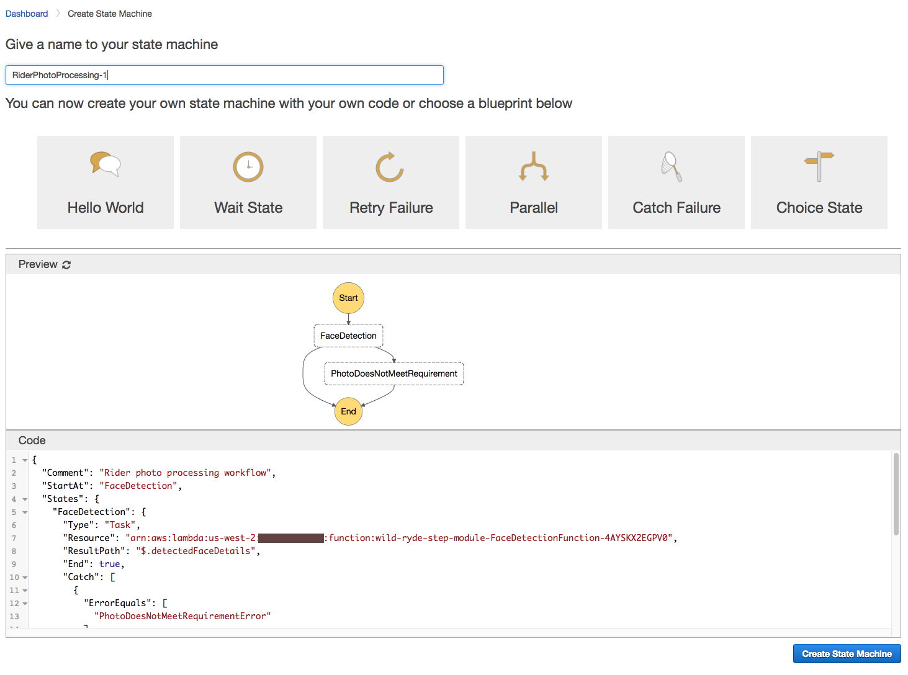


1. Click **Create State Machine** to create the state machine.

1. In the pop-up window, select the IAM role automatically generated for you (the name should look like `StatesExecutionRole-{region-name}`).

	

1. Click the **New execution** button to start a new execution.

1. Here you specify the input data passed into the AWS Step Functions state machine to process.

   Each execution of a Step Functions state machine has an unique ID. You can either specify one when starting the execution, or have the service generate one for you. In the text field that says "enter your execution id here",  you can specify an execution ID, or leave it blank. 
   
   For the input data, type in the follow JSON. Make sure to substitute the `s3Bucket` field with your own values. 
   
	For `s3Bucket` field, look in the **Outputs** section of the `wildrydes-step-module-resources` stack for `RiderPhotoS3Bucket`. 
	
	The `userId` field is needed because in later processing steps, the userId is used to record which user the profile picture is associated with.

	
	```JSON
	{
	  "userId": "user_a", 
	  "s3Bucket": "REPLACE_WITH_YOUR_BUCKET_NAME",
	  "s3Key": "1_happy_face.jpg"
	} 
	```
	> this tells the image processing workflow the userId that uploaded the picture and the Amazon S3 bucket and keys the photo is at.  
	
	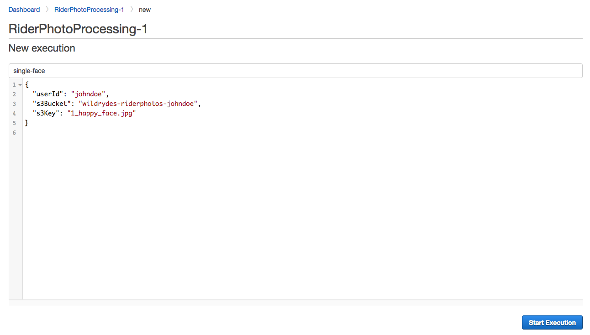

1. You can now see the state machine execution in action. Explore the different tabs in the Console to see what information is available to you for this execution:

	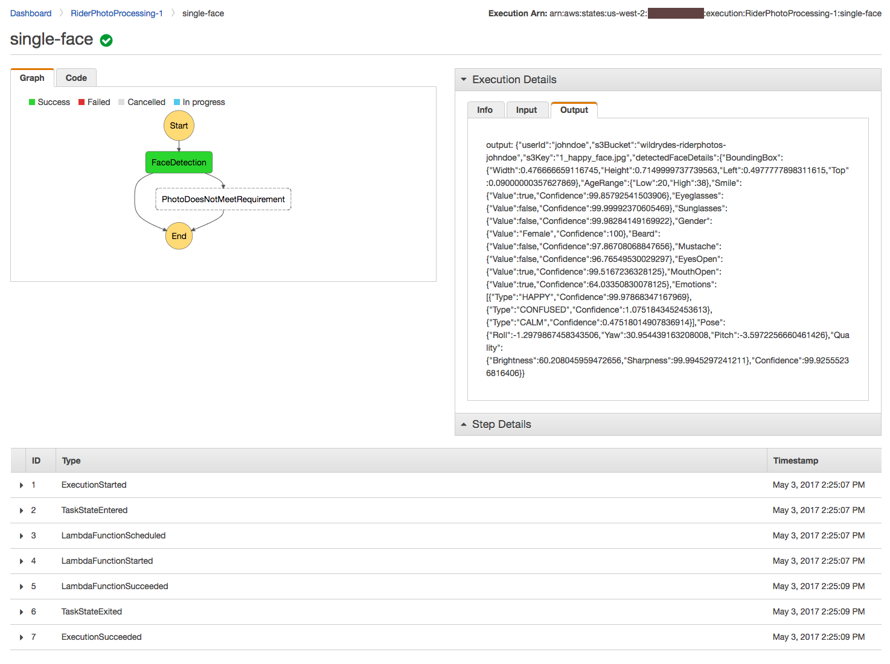

1. Create another execution by passing in the s3 key of a photo that wears sunglasses, see how the execution differs:  

	```JSON
	{
	  "userId": "user_b",
	  "s3Bucket": "REPLACE_WITH_YOUR_BUCKET_NAME",
	  "s3Key": "2_sunglass_face.jpg"
	} 
	```
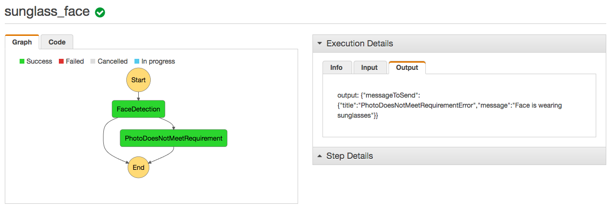
</p></details>


### 4. Add steps to prevent duplication and add face to index

If the uploaded photo has passed the basic face detection checks, the next step is to ensure the face has not been stored in our collection already to prevent the same user from signing up multiple times. In this section, you will add a **CheckFaceDuplicate** step to your state machine by leveraging the `FaceSearchFunction` AWS Lambda function.

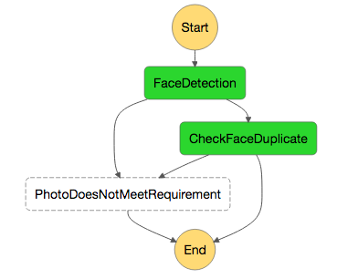

<details>
<summary><strong>Step-by-step instructions (expand for details)</strong></summary><p>

1. Edit your `rider-photo-state-machine.json` file to add a new step to the workflow. 

   First, add a new state `CheckFaceDuplicate` following the `PhotoDoesNotMeetRequirement` state. Then, replace the `REPLACE_WITH_FaceSearchFunctionArn` with the `FaceSearchFunctionArn` from the AWS CloudFormation output: 


	```JSON
	,
    "CheckFaceDuplicate": {
      "Type": "Task",
      "Resource": "REPLACE_WITH_FaceSearchFunctionArn",
      "ResultPath": null,
      "End": true,
      "Catch": [
        {
          "ErrorEquals": [
            "FaceAlreadyExistsError"
          ],
          "ResultPath": "$.errorInfo",
          "Next": "PhotoDoesNotMeetRequirement"
        }
      ]
    }
	```
1. Find the line in the `FaceDetection` state that marks it as the End state of the state machine

	```JSON
	     	 "End": true,

	```
	and replace it with
	
	```JSON
      		"Next": "CheckFaceDuplicate",

	```
	This tells AWS Step Functions if the  `FaceDetection` state runs successfully, go on to run the `CheckFaceDuplicate` state as the next step in the process. 

1. At this point, your `rider-photo-state-machine.json` file should look like this (the AWS Lambda ARNs are examples): 
	<details>
	<summary><strong>(expand to see)</strong></summary><p>

	```JSON
	{
	  "Comment": "Rider photo processing workflow",
	  "StartAt": "FaceDetection",
	  "States": {
	    "FaceDetection": {
	      "Type": "Task",
	      "Resource": "arn:aws:lambda:us-west-2:012345678912:function:wild-ryde-step-module-FaceDetectionFunction-4AYSKX2EGPV0",
	      "ResultPath": "$.detectedFaceDetails",
	      "Next": "CheckFaceDuplicate",
	      "Catch": [
	        {
	          "ErrorEquals": [
	            "PhotoDoesNotMeetRequirementError"
	          ],
	          "ResultPath": "$.errorInfo",
	          "Next": "PhotoDoesNotMeetRequirement"
	        }
	      ]
	    },
	    "PhotoDoesNotMeetRequirement": {
	      "Type": "Task",
	      "Resource": "arn:aws:lambda:us-west-2:012345678912:function:wild-ryde-step-module-NotificationPlaceholderFunct-CDRLZC8BRFWP",
	      "End": true
	    },
	    "CheckFaceDuplicate": {
	      "Type": "Task",
	      "Resource": "arn:aws:lambda:us-west-2:012345678912:function:wild-ryde-step-module-FaceSearchFunction-1IT67V4J214DC",
	      "ResultPath": null,
	      "End": true,
	      "Catch": [
	        {
	          "ErrorEquals": [
	            "FaceAlreadyExistsError"
	          ],
	          "ResultPath": "$.errorInfo",
	          "Next": "PhotoDoesNotMeetRequirement"
	        }
	      ]
	    }
	  }
	}
	```
	</p></details>

1. Go back the AWS Step Functions Console, create a new state machine `RiderPhotoProcessing-2` by copy-pasting the updated JSON definition:

	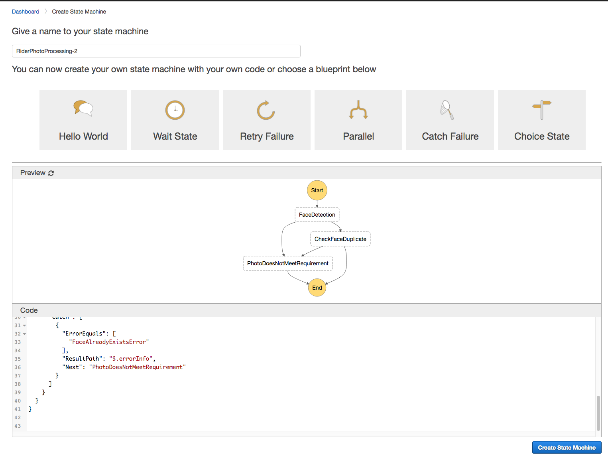

	> **Note**: AWS Step Functions state machines are immutable. Therefore, every time you want to change the state machine definition, you must always create a new state machine. 
	
1. Test the new state machine with the test input you've used before:

	```JSON
	{
	  "userId": "user_a",
	  "s3Bucket": "REPLACE_WITH_YOUR_BUCKET_NAME",
	  "s3Key": "1_happy_face.jpg"
	} 
	```
	Because we haven't added the step yet to index the face in the photo into the Rekognition collection, the `CheckFaceDuplicate` step will always succeed at this point. 


</p></details>

### 5. Add parallel processing step

If the uploaded photo passes both the `FaceDetection` and `CheckFaceDuplicate` stage, we can now proceed to index the rider's face and resize the photo for displaying in the app. Since these two steps don't depend on one another, they can be run in parallel. We will add a Parallel state in AWS Step Functions to run these steps. 

The ARNs of the two AWS Lambda functions that performs face index and generate thumbnails can be found in the AWS CloudFormation output `IndexFaceFunctionArn` and `ThumbnailFunctionArn` respectively. 


<details>
<summary><strong>Step-by-step instructions (expand for details)</strong></summary><p>

1. Edit your `rider-photo-state-machine.json` file to add a parallel step (with two sub-steps) to the workflow. 

   First, add a new state `ParallelProcessing` following the `CheckFaceDuplicate` state. Also make sure:
   
   *   Replace the `REPLACE_WITH_IndexFaceFunctionArn` with the `IndexFaceFunctionArn` from the AWS CloudFormation output.
   *   Replace the `REPLACE_WITH_ThumbnailFunctionArn` with the `ThumbnailFunctionArn` from the AWS CloudFormation output. 

	```JSON
    ,
    "ParallelProcessing": {
      "Type": "Parallel",
      "Branches": [
        {
          "StartAt": "AddFaceToIndex",
          "States": {
            "AddFaceToIndex": {
              "Type": "Task",
              "Resource": "REPLACE_WITH_IndexFaceFunctionArn",
              "End": true
            }
          }
        },
        {
          "StartAt": "Thumbnail",
          "States": {
            "Thumbnail": {
              "Type": "Task",
              "Resource": "REPLACE_WITH_ThumbnailFunctionArn",
              "End": true
            }
          }
        }
      ],
	   "ResultPath": "$.parallelResult",
      "End": true
    }
	```
	
1. Find the line in the `CheckFaceDuplicate` state that marks it as the End state of the state machine.

	```JSON
	     	 "End": true,

	```
	and replace it with
	
	```JSON
      		"Next": "ParallelProcessing",

	```
	This tells AWS Step Functions if the  `CheckFaceDuplicate ` state runs successfully, go on to run the `ParallelProcessing ` state as the next step in the process. 

1. At this point, your `rider-photo-state-machine.json` file should look like this (the AWS Lambda ARNs are examples): 
	
	<details>
	<summary><strong>(expand to see)</strong></summary><p>

	```JSON
	{
	  "Comment": "Rider photo processing workflow",
	  "StartAt": "FaceDetection",
	  "States": {
	    "FaceDetection": {
	      "Type": "Task",
	      "Resource": "arn:aws:lambda:us-west-2:012345678912:function:wild-ryde-step-module-FaceDetectionFunction-4AYSKX2EGPV0",
	      "ResultPath": "$.detectedFaceDetails",
	      "Next": "CheckFaceDuplicate",
	      "Catch": [
	        {
	          "ErrorEquals": [
	            "PhotoDoesNotMeetRequirementError"
	          ],
	          "ResultPath": "$.errorInfo",
	          "Next": "PhotoDoesNotMeetRequirement"
	        }
	      ]
	    },
	    "PhotoDoesNotMeetRequirement": {
	      "Type": "Task",
	      "Resource": "arn:aws:lambda:us-west-2:012345678912:function:wild-ryde-step-module-NotificationPlaceholderFunct-CDRLZC8BRFWP",
	      "End": true
	    },
	    "CheckFaceDuplicate": {
	      "Type": "Task",
	      "Resource": "arn:aws:lambda:us-west-2:012345678912:function:wild-ryde-step-module-FaceSearchFunction-1IT67V4J214DC",
	      "ResultPath": null,
	      "Next": "ParallelProcessing",
	      "Catch": [
	        {
	          "ErrorEquals": [
	            "FaceAlreadyExistsError"
	          ],
	          "ResultPath": "$.errorInfo",
	          "Next": "PhotoDoesNotMeetRequirement"
	        }
	      ]
	    },
	    "ParallelProcessing": {
	      "Type": "Parallel",
	      "Branches": [
	        {
	          "StartAt": "AddFaceToIndex",
	          "States": {
	            "AddFaceToIndex": {
	              "Type": "Task",
	              "Resource": "arn:aws:lambda:us-west-2:012345678912:function:wild-ryde-step-module-IndexFaceFunction-15658V8WUI67V",
	              "End": true
	            }
	          }
	        },
	        {
	          "StartAt": "Thumbnail",
	          "States": {
	            "Thumbnail": {
	              "Type": "Task",
	              "Resource": "arn:aws:lambda:us-west-2:012345678912:function:wild-ryde-step-module-ThumbnailFunction-A30TCJMIG0U8",
	              "End": true
	            }
	          }
	        }
	      ],
	      "ResultPath": "$.parallelResult",
	      "End": true
	    }
	  }
	}
	```
	</p></details>

1. Go back the AWS Step Functions Console, create a new state machine `RiderPhotoProcessing-3` by copy-pasting the updated JSON definition:

	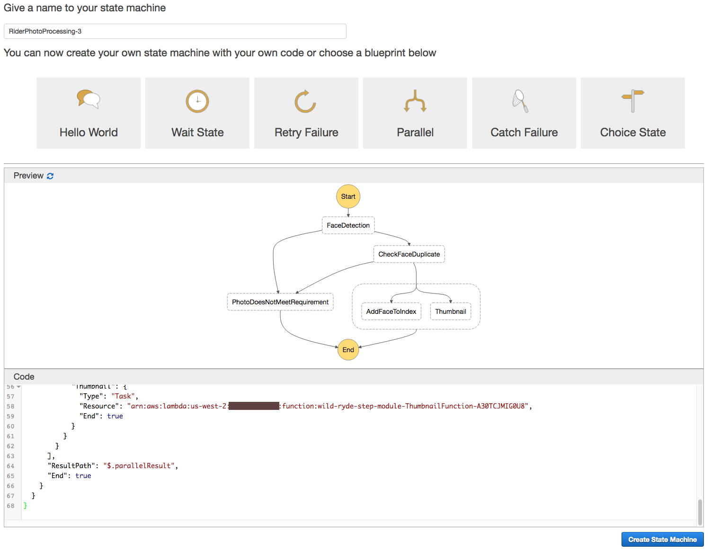

	> **Note**: AWS Step Functions state machines are immutable. Therefore, every time you want to change the state machine definition, you must always create a new state machine. 
	
1. Test the new state machine with the test input you've used before:

	```JSON
	{
	  "userId": "user_a",
	  "s3Bucket": "REPLACE_WITH_YOUR_BUCKET_NAME",
	  "s3Key": "1_happy_face.jpg"
	} 
	```

1. If last step succeeds, you can use the AWS CLI to check the list of faces indexed in your Rekognition collection (replace the `REPLACE_WITH_YOUR_CHOSEN_AWS_REGION` portion with the region string of your chosen region):

	```
	aws rekognition list-faces --collection-id rider-photos --region REPLACE_WITH_YOUR_CHOSEN_AWS_REGION
	```
	
	> You might find the `delete-faces` command useful when testing:

	```
	aws rekognition delete-faces --collection-id rider-photos --face-ids REPLACE_WITH_ID_OF_FACE_TO_DELETE --region REPLACE_WITH_YOUR_CHOSEN_AWS_REGION
	```

1. You can also use the Amazon S3 Console to check the Amazon S3 bucket created by AWS CloudFormation to store the resized thumbnail images. You should find resized thumbnail images in the bucket.

	> The name of the S3 bucket can be found in the in AWS CloudFormation output `ThumbnailS3Bucket`. You can also simply search for it in the S3 Console for `wildrydes-step-module-resources-thumbnails3bucket`

1. What happens if you start a new workflow with a different `userId` but the same s3key and s3bucket parameters?  


</p></details>

### 6. Add metadata persistence step

The last step of our image processing workflow is to persist the metadata of the profile photo with the user's profile.

The ARN of the AWS Lambda function that persists the metadata can be found in the in AWS CloudFormation output `PersistMetadataFunctionArn`.


<details>
<summary><strong>Step-by-step instructions (expand for details)</strong></summary><p>

1. Edit your `rider-photo-state-machine.json` file to add the final persistence step. 
 
   First, add a new state `PersistMetadata` following the `ParallelProcessing` state. Also make sure:
   
   *   Replace the `REPLACE_WITH_PersistMetadataFunctionArn` with the `PersistMetadataFunctionArn ` from the AWS CloudFormation output

	```JSON
	    ,
	    "PersistMetadata": {
	      "Type": "Task",
	      "Resource": "REPLACE_WITH_PersistMetadataFunctionArn",
	      "ResultPath": null,
	      "End": true
	    }

	```

1. Find the line in the `ParallelProcessing` state that marks it as the End state of the state machine.

	```JSON
	     	 "End": true

	```
	and replace it with
	
	```JSON
      		"Next": "PersistMetadata"

	```
	> **Note**: be careful to edit the `"End"` line at the `ParallelProcessing` level, not the individual branch level within the parallel state. 
	
	This tells AWS Step Functions if the `ParallelProcessing` state runs successfully, go on to run the `PersistMetadata` state as the next step in the process. 

1. At this point, your `rider-photo-state-machine.json` file should look like this (the AWS Lambda ARNs are examples): 
	<details>
	<summary><strong>(expand to see)</strong></summary><p>

	```JSON
	{
	  "Comment": "Rider photo processing workflow",
	  "StartAt": "FaceDetection",
	  "States": {
	    "FaceDetection": {
	      "Type": "Task",
	      "Resource": "arn:aws:lambda:us-west-2:012345678912:function:wild-ryde-step-module-FaceDetectionFunction-4AYSKX2EGPV0",
	      "ResultPath": "$.detectedFaceDetails",
	      "Next": "CheckFaceDuplicate",
	      "Catch": [
	        {
	          "ErrorEquals": [
	            "PhotoDoesNotMeetRequirementError"
	          ],
	          "ResultPath": "$.errorInfo",
	          "Next": "PhotoDoesNotMeetRequirement"
	        }
	      ]
	    },
	    "PhotoDoesNotMeetRequirement": {
	      "Type": "Task",
	      "Resource": "arn:aws:lambda:us-west-2:012345678912:function:wild-ryde-step-module-NotificationPlaceholderFunct-CDRLZC8BRFWP",
	      "End": true
	    },
	    "CheckFaceDuplicate": {
	      "Type": "Task",
	      "Resource": "arn:aws:lambda:us-west-2:012345678912:function:wild-ryde-step-module-FaceSearchFunction-1IT67V4J214DC",
	      "ResultPath": null,
	      "Next": "ParallelProcessing",
	      "Catch": [
	        {
	          "ErrorEquals": [
	            "FaceAlreadyExistsError"
	          ],
	          "ResultPath": "$.errorInfo",
	          "Next": "PhotoDoesNotMeetRequirement"
	        }
	      ]
	    },
	    "ParallelProcessing": {
	      "Type": "Parallel",
	      "Branches": [
	        {
	          "StartAt": "AddFaceToIndex",
	          "States": {
	            "AddFaceToIndex": {
	              "Type": "Task",
	              "Resource": "arn:aws:lambda:us-west-2:012345678912:function:wild-ryde-step-module-IndexFaceFunction-15658V8WUI67V",
	              "End": true
	            }
	          }
	        },
	        {
	          "StartAt": "Thumbnail",
	          "States": {
	            "Thumbnail": {
	              "Type": "Task",
	              "Resource": "arn:aws:lambda:us-west-2:012345678912:function:wild-ryde-step-module-ThumbnailFunction-A30TCJMIG0U8",
	              "End": true
	            }
	          }
	        }
	      ],
	      "ResultPath": "$.parallelResult",
	      "Next": "PersistMetadata"
	    },
	    "PersistMetadata": {
	      "Type": "Task",
	      "Resource": "arn:aws:lambda:us-west-2:012345678912:function:wild-ryde-step-module-PersistMetadataFunction-9PDCT2DT7K70",
	      "ResultPath": null,
	      "End": true
	    }
	  }
	}	
	```
	</p></details>

1. Go back the AWS Step Functions Console, create a new state machine `RiderPhotoProcessing-4` by copy-pasting the updated JSON definition:

	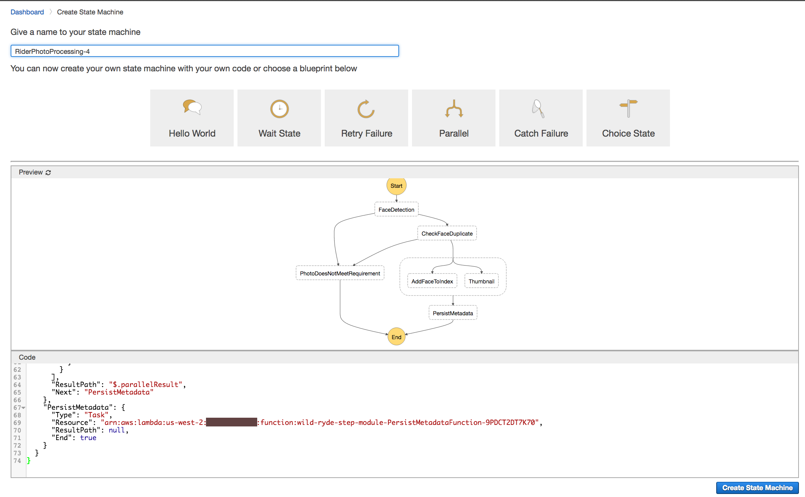
	
1. Test the new state machine with test input:

	```JSON
	{
	  "userId": "user_a",
	  "s3Bucket": "REPLACE_WITH_YOUR_BUCKET_NAME",
	  "s3Key": "1_happy_face.jpg"
	} 
	```
	
	If you reference an image that's already indexed when you were testing the previous state machine, the execution would fail the `CheckFaceDuplicate` step like this:
	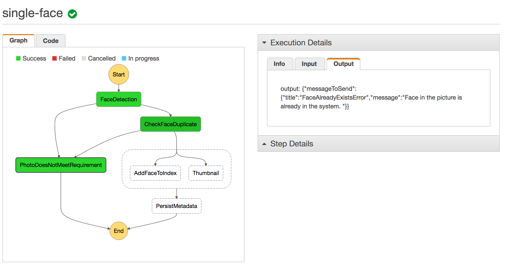

	You can use the `aws rekognition list-faces` and `aws rekognition delete-faces` commands to clean up the previous indexed faces during testing. Or you can upload a different picture to the `RiderPhotoS3Bucket` and use the s3 key of the new picture to test. 
	
	
</p></details>

## Implementation Validation

1. Test the final state machine (`RiderPhotoProcessing-4`) with different test images provided 

	Photo with sunglasses:

	```JSON
	{
	  "userId": "user_b",
	  "s3Bucket": "REPLACE_WITH_YOUR_BUCKET_NAME",
	  "s3Key": "2_sunglass_face.jpg"
	} 
	```

	Photo with multiple faces in it:
	
	```JSON
	{
	  "userId": "user_c",
	  "s3Bucket": "REPLACE_WITH_YOUR_BUCKET_NAME",
	  "s3Key": "3_multiple_faces.jpg"
	} 
	```
	
	Photo with no faces in it:

	```JSON
	{
	  "userId": "user_d",
	  "s3Bucket": "REPLACE_WITH_YOUR_BUCKET_NAME",
	  "s3Key": "4_no_face.jpg"
	} 
	```
	
1. Upload some pictures you have to S3, test some executions. If you have more than one picture of the same person, upload them both and run the workflow on each picture (make sure to use different `userId` fields in the test input). Verify the **CheckFaceDuplicate** step will prevent the same face from being indexed more than once. 

1. Go to the Amazon DynamoDB console, look for a table with name starting with "wildrydes-step-module-resources-RiderPhotoDDBTable" (you can also find the table name in the CloudFormation stack output). Check out the items of the table. 
	
	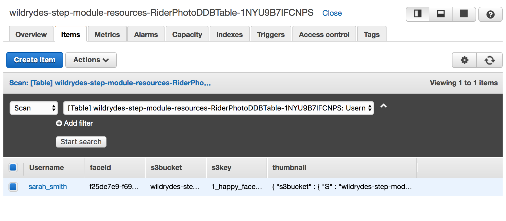

1. Go to the Amazon S3 console, verify the thumbnail images of the photos you processed are in the thumbnail S3 Bucket. 

Now you have built a multi-step image processing workflow using AWS Step Functions! The workflow can be integrated to your app by fronting it with AWS API Gateway or triggered from an Amazon S3 upload event.  

## Extra credit
The intent of the **PhotoDoesNotMeetRequirement**  step is to send notification to the user that the verification of their profile photo failed so they might try uploading a different picture. It currently uses the AWS Lambda function `NotificationPlaceholderFunction` which simply returns the message instead of actually sending the notification. Implement sending email notifications in the Lambda function using Amazon Simple Email Service (SES). 

## Clean-up 

1. Delete the `RiderPhotoProcessing-*` state machines from the AWS Step Functions console.

	<details>
	<summary><strong>Step-by-step instructions (expand for details)</strong></summary><p>
	
	In the AWS Step Functions Management Console, go to **Dashboard**, select the state machine to delete, then click **Delete**.
	
	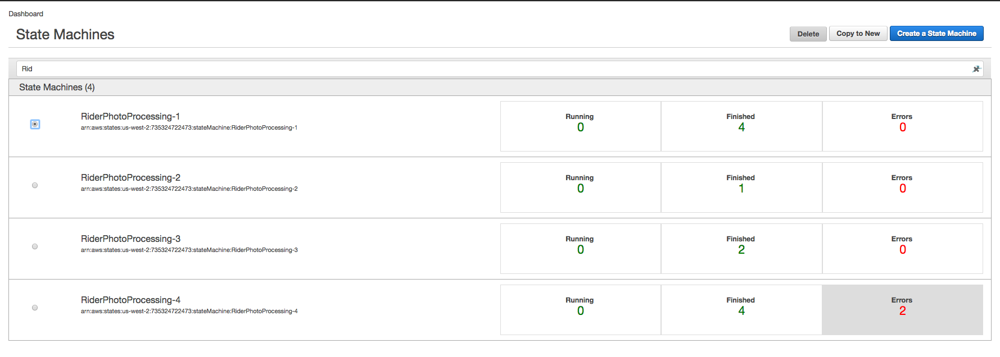 
	
	</p></details>

1. Empty the Amazon S3 buckets used to store rider images and thumbnails.

	<details>
	<summary><strong>Step-by-step instructions (expand for details)</strong></summary><p>
	
	1. In the Amazon S3 Management Console, click on the  icon next to Amazon S3 bucket used to store rider photos (The S3 bucket should have a name similar to `wildrydes-step-module-resource-riderphotos3bucket-7l698ggkdcf3`).
	 
		 
	1. Click on the **Empty Bucket** button.
	
		
		
	1. Copy/paste the bucket name into the pop-up box, then click **Confirm**.
	
		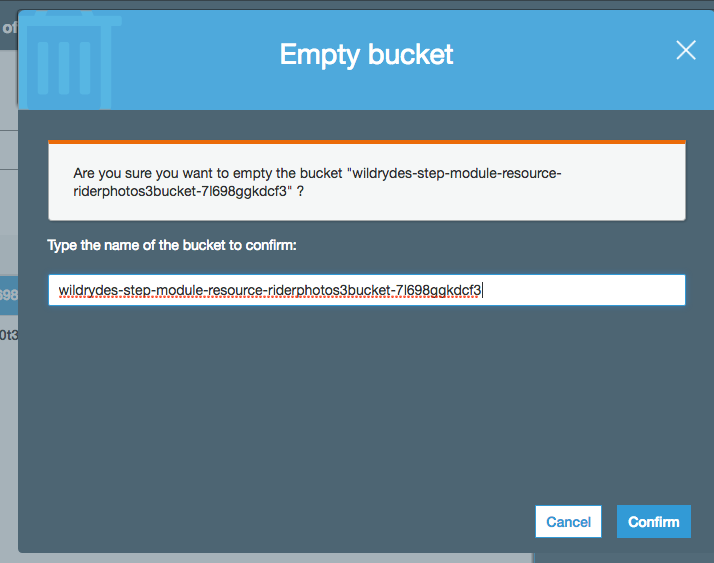
		
	1. Repeat the steps to empty the Amazon S3 bucket used to store photo thumbnails (it should have a name similar to `wildrydes-step-module-resources-thumbnails3bucket-1j0t3m28k7mxo`).

	</p></details>

1. Delete the `wildrydes-step-module-resources` AWS CloudFormation stack that launched the AWS Lambda functions, Amazon S3 buckets and Amazon DynamoDB table.

	<details>
	<summary><strong>Step-by-step instructions (expand for details)</strong></summary><p>
	
	1. In the AWS CloudFormation Management Console, select the `wildrydes-step-module-resources` stack.
	
 	1. Select **Delete Stack** under **Actions**.
 	
		
	
	1. Click **Yes, Delete**
	
	</p></details>
	
1. Delete the Amazon Rekognition collection.


	<details>
	<summary><strong>Step-by-step instructions (expand for details)</strong></summary><p>
	
	1. In a terminal window, run the following command and replace the `REPLACE_WITH_YOUR_CHOSEN_AWS_REGION` portion with the AWS region you have used. 

			aws rekognition delete-collection --region REPLACE_WITH_YOUR_CHOSEN_AWS_REGION --collection-id rider-photos
	
		For example:
	
			aws rekognition delete-collection --region us-east-1 --collection-id rider-photos
			aws rekognition delete-collection --region us-west-2 --collection-id rider-photos
			aws rekognition delete-collection --region eu-west-1 --collection-id rider-photos
	
	
	2. If successful, you should get an acknowledgment from the service that looks like:

		```JSON
		{
	    	"StatusCode": 200
		}
		```
	
	</p></details>
